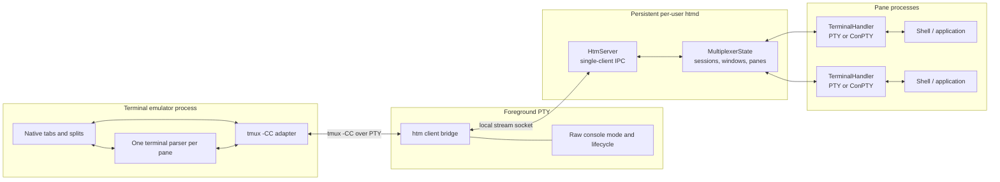
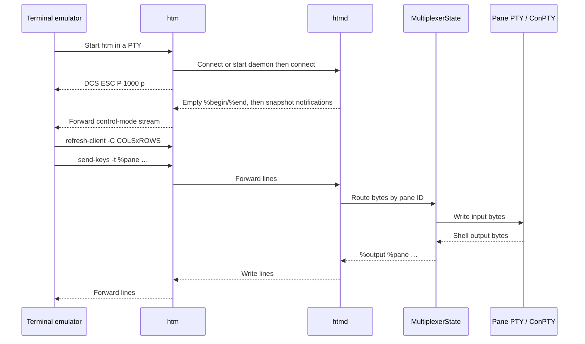
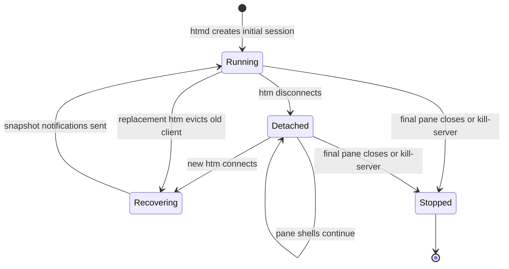

# HTM Design and Architecture

## Summary

HTM is a terminal multiplexer whose presentation belongs to the terminal
emulator rather than to a full-screen multiplexer UI. The terminal emulator
renders native tabs and splits; the persistent `htmd` daemon owns the layout
model and one shell PTY per pane; the short-lived `htm` process bridges the
two over tmux control mode (`tmux -CC`).

The design separates terminal-specific UI from durable process state. A
terminal emulator can detach, crash, or restart without terminating shells,
and can reconstruct its UI from control-mode snapshot notifications.

See [HTM and tmux Control Mode](htm-terminal-protocol.md) for how a terminal
talks to `htm`, the [tmux Control Mode
wiki](https://github.com/tmux/tmux/wiki/Control-Mode) for the protocol
itself, and [`htm` to `htmd` IPC Protocol](htm-ipc-protocol.md) for the local
process boundary.

## Goals

- Let terminal emulators represent multiplexer tabs and splits with their own
  native UI, using the same control-mode dialect they already use with tmux.
- Keep shell processes and layout state alive when the foreground terminal
  disconnects.
- Carry arbitrary terminal input and output without interpreting it in the
  multiplexer (beyond what `capture-pane` needs).
- Support Unix PTYs and Windows ConPTY behind one pane abstraction.
- Recover a usable session with a small, deterministic attachment sequence.
- Avoid unbounded buffering and input/output deadlocks under backpressure.

## Non-goals

- HTM does not provide remote transport; Eternal Terminal's existing remote
  protocol is a separate layer.
- HTM does not render terminal contents or split decorations.
- HTM does not persist sessions across daemon or machine restarts.
- HTM does not currently support multiple simultaneous UI clients for one
  daemon.
- HTM is not a full tmux server: copy-mode, format subscriptions, linked
  windows, and many tmux commands are absent or no-ops.

## Architecture

### Terminal emulator adapter

The adapter owns presentation and control-mode parsing. It launches `htm`,
detects DCS `ESC P 1000 p`, reconstructs native tabs and splits from
`%window-add` / `%layout-change` (or `list-windows`), and maps tmux pane IDs
(`%n`) to emulator surfaces. It also owns one terminal parser per pane so
escape-sequence state cannot leak between panes.

This component is intentionally outside the Eternal Terminal repository for
real integrations (iTerm2's built-in tmux gateway, WezTerm, Hyper's
hyper-htm plugin, and so on). The repository's PTY and terminal-specific
tests act as reference adapters.

### `htm`: foreground bridge

`htm` is coupled to the terminal emulator's PTY lifetime. It:

- configures stdin/stdout for raw virtual-terminal I/O and restores them on
  exit;
- finds, starts, or replaces the per-user daemon;
- connects to the local IPC endpoint;
- writes the tmux `-CC` DCS, then forwards terminal input to `htmd` and
  daemon output to the terminal;
- writes ST (`ESC \`) on normal or abnormal termination;
- applies bounded, nonblocking queues on Unix to avoid a blocked terminal
  output path starving terminal input.

`htm` does not own multiplexer state and can be replaced at any time.

### `htmd`: persistent daemon

`htmd` owns one `HtmServer` and one `MultiplexerState`. It listens on a
per-user local socket, accepts one active bridge, parses control-mode
command lines, mutates the layout, and polls pane handlers for output and
process exit.

The daemon survives bridge disconnection. Accepting a new bridge evicts the
old one and invokes recovery. It stops when the last pane closes or when
`kill-server` is received.

### `MultiplexerState`: authoritative model

The state model uses tmux identity and topology:

- sessions (`$id`), each with a name and an ordered list of windows;
- windows (`@id`), each with a name, cell size, and a split tree;
- splits, stacked (`[…]`) or side-by-side (`{…}`), with proportional sizes;
- panes (`%id`), each with a parent, cell geometry, `TerminalHandler`, and a
  libvterm `PaneScreen` for `capture-pane`.

The daemon is authoritative for topology and allocates IDs. Closing a pane
collapses a split when only one child remains. Layout is serialized with
tmux's checksummed layout string.

### `TerminalHandler`: platform PTY abstraction

Each pane has one handler and one child shell:

- Unix uses `forkpty`, a nonblocking PTY master, and the user's `$SHELL` (or
  `/bin/sh`).
- Windows uses ConPTY and `$SHELL`, `%COMSPEC%`, or `cmd.exe` in that order.

The handler passes input bytes through unchanged, returns newly available
output bytes, applies cell-size changes, and observes child exit. The child
receives `HTM_VERSION` in its environment.

## State and data flow

### Startup and normal operation

The stream is asynchronous. Output from different panes can interleave at
line boundaries, but bytes within a pane remain ordered.

### Detach and recovery

Recovery sends current topology rather than replaying layout mutations. An
adapter must treat `%window-add` / `%layout-change` (or a fresh `list-*`) as
authoritative and idempotently reconcile its UI. Detached pane output is not
replayed as `%output`.

## Key design decisions

### Native terminal UI via tmux -CC

HTM transports topology and pane streams instead of drawing a character-cell
user interface. Using tmux control mode means iTerm2, WezTerm, Hyper, and
other existing `-CC` clients can attach without a private opcode set. The
cost is that HTM must stay close enough to tmux for those parsers.

### tmux IDs instead of positional routing

All operations address `$session`, `@window`, and `%pane`. Positions change
when windows are reordered or splits collapse; IDs keep pane streams and UI
surfaces correctly paired. Nested layouts serialize as tmux layout strings
rather than process-local pointers.

### Snapshot recovery without output replay

A layout snapshot avoids a durable mutation journal and acknowledgement
protocol. Reattached UIs get windows and splits immediately. The tradeoff is
that a reconnect does not resume pane output at an exact byte offset;
`capture-pane` is available when an integrator needs the current screen.

### One active client

Single-client ownership avoids focus arbitration, concurrent layout edits,
and output acknowledgement across several UIs. Replacement semantics make
recovery predictable. Collaborative viewing would require explicit client
identities, mutation ordering, and per-client delivery state.

### Backpressure at the bridge

Terminal emulators can stop reading while their UI thread is busy. A blocking
write in `htm` must not prevent it from accepting input, or both sides can
deadlock. The Unix bridge therefore queues bytes, caps queues at 256 KiB, and
lets socket backpressure reach the daemon. tmux-style `pause-after` /
`%extended-output` is available when a client opts in. Equivalent
bounded/nonblocking behavior is an important requirement for every platform
implementation.

### Compatibility version, not a private handshake

`#{version}` reports `3.5a` so GUI clients enable modern `refresh-client`
and layout flags. Unknown commands already return `%error`, so new commands
can be added without a private capability exchange. Incompatible changes to
notification syntax still need an explicit client-by-client decision.

## Invariants

- Exactly one `TerminalHandler` exists for every live pane.
- Every pane and split has exactly one parent; every window has one root
  child.
- Session, window, and pane IDs are unique in their namespaces.
- A split's child and size arrays have equal lengths and matching order.
- Input/output bytes for a pane are routed only by that pane's ID.
- The daemon, not the attached UI, is authoritative after recovery.
- Notifications are never emitted inside an open `%begin`/`%end` block.

## Security and trust boundary

The IPC peer can create shells, inject arbitrary keystrokes, resize
terminals, and terminate panes. It is therefore equivalent to controlling
the user's interactive shell session. The endpoint must remain local and
accessible only within the intended user boundary.

The current protocol has no authentication or integrity protection of its
own. Endpoint permissions, process ownership, and operating-system
local-socket security are part of the design. A future multi-user or remote
transport must add authentication before reusing the message layer.

## Testing strategy

The implementation is tested at complementary layers:

- unit tests validate layout mutation, control-mode parsing, reconnects,
  pane routing, close behavior, and malformed commands;
- PTY end-to-end tests run real `htm` and `htmd` processes and exercise the
  DCS / `%session-changed` / command stream a terminal sees;
- terminal-specific opt-in tests validate native integration for iTerm2,
  Hyper, WezTerm, and Ghostty;
- stress tests verify concurrent pane output and continued input progress
  when terminal output is backed up;
- Windows tests cover the same portable control-mode/state behavior with
  ConPTY and local `AF_UNIX` transport.

Any command or notification change should add a unit test, a real-process
PTY test, and—when it affects UI semantics—a terminal-specific end-to-end
case.

## Known limitations and evolution

The largest architectural gaps are authenticated IPC, crash-persistent
sessions, exact output replay positions, multi-client support, and remaining
tmux surface area (copy-mode, format subscriptions, linked windows, a
broader `list-commands` set). These should not be added as silent breaks of
notification syntax that existing `-CC` clients already parse.

A compatible evolution path is:

1. keep speaking tmux control mode and report a version string those clients
   understand;
2. add commands that today's clients ignore or probe via `list-commands`;
3. extend notifications only in forms known clients already accept (or behind
   a `refresh-client -f` flag);
4. only then introduce features that require incompatible lifecycle
   semantics.
