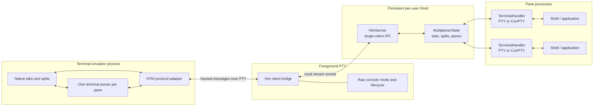
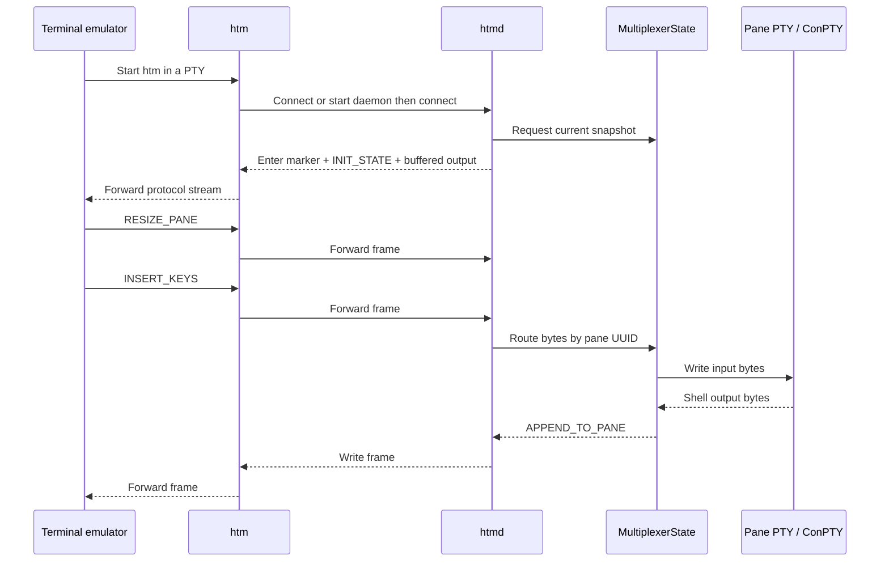
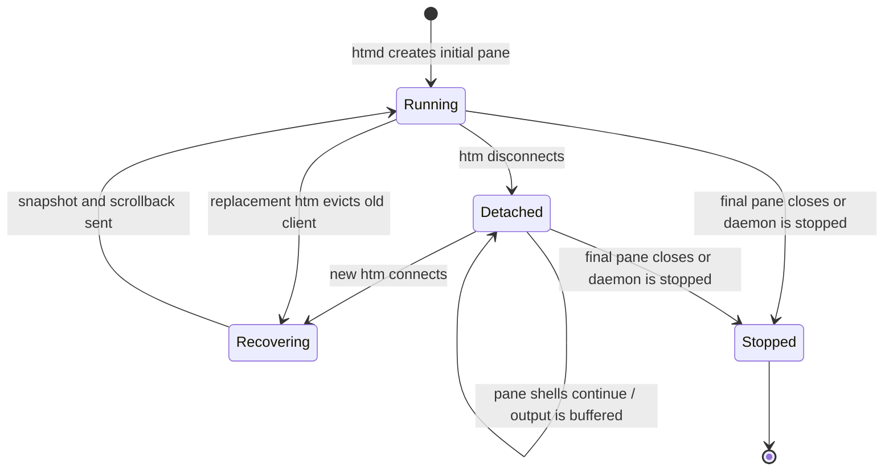

# HTM Design and Architecture

## Summary

HTM is a terminal multiplexer whose presentation belongs to the terminal
emulator rather than to a full-screen multiplexer UI. The terminal emulator
renders native tabs and splits; the persistent `htmd` daemon owns the layout
model and one shell PTY per pane; the short-lived `htm` process bridges the two.

The design separates terminal-specific UI from durable process state. A
terminal emulator can detach, crash, or restart without terminating shells, and
can reconstruct its UI from a daemon snapshot and bounded pane scrollback.

See [HTM Terminal Emulator Protocol](htm-terminal-protocol.md) for the external
integration contract and [`htm` to `htmd` IPC
Protocol](htm-ipc-protocol.md) for the local process boundary.

## Goals

- Let terminal emulators represent multiplexer tabs and splits with their own
  native UI.
- Keep shell processes and layout state alive when the foreground terminal
  disconnects.
- Carry arbitrary terminal input and output without interpreting it in the
  multiplexer.
- Support Unix PTYs and Windows ConPTY behind one pane abstraction.
- Recover a complete usable session with a small, deterministic attachment
  sequence.
- Avoid unbounded buffering and input/output deadlocks under backpressure.

## Non-goals

- HTM does not provide remote transport; Eternal Terminal's existing remote
  protocol is a separate layer.
- HTM does not render terminal contents or split decorations.
- HTM does not persist sessions across daemon or machine restarts.
- HTM does not currently support multiple simultaneous UI clients for one
  daemon.
- HTM does not currently negotiate protocol versions or capabilities.

## Architecture

### Terminal emulator adapter

The adapter owns presentation and protocol parsing. It launches `htm`, detects
the HTM enter/exit markers, reconstructs native tabs and splits from
`INIT_STATE`, and maps stable UUIDs to emulator surfaces. It also owns one
terminal parser per pane so escape-sequence state cannot leak between panes.

This component is intentionally outside the Eternal Terminal repository for
real integrations. The repository's PTY and terminal-specific tests act as
reference adapters.

### `htm`: foreground bridge

`htm` is coupled to the terminal emulator's PTY lifetime. It:

- configures stdin/stdout for raw virtual-terminal I/O and restores them on
  exit;
- finds, starts, or replaces the per-user daemon;
- connects to the local IPC endpoint;
- forwards terminal input to `htmd` and daemon output to the terminal;
- emits the terminal exit marker on normal or abnormal termination;
- applies bounded, nonblocking queues on Unix to avoid a blocked terminal
  output path starving terminal input.

`htm` does not own multiplexer state and can be replaced at any time.

### `htmd`: persistent daemon

`htmd` owns one `HtmServer` and one `MultiplexerState`. It listens on a per-user
local socket, accepts one active bridge, validates client messages, mutates the
layout, and polls pane handlers for output and process exit.

The daemon survives bridge disconnection. Accepting a new bridge evicts the old
one and invokes recovery. It stops when the last pane closes or when explicitly
requested.

### `MultiplexerState`: authoritative model

The state model contains:

- tabs, each with a stable UUID, display order, and one root pane or split;
- splits, each with a generated UUID, orientation, ordered child IDs, and
  proportional sizes;
- panes, each with a stable UUID, parent relationship, and `TerminalHandler`.

The daemon is authoritative for topology. The terminal emulator chooses IDs for
new tabs and panes, while the daemon creates IDs for split containers. Closing
a pane updates tab order and collapses a split when only one child remains.

### `TerminalHandler`: platform PTY abstraction

Each pane has one handler and one child shell:

- Unix uses `forkpty`, a nonblocking PTY master, and the user's `$SHELL` (or
  `/bin/sh`).
- Windows uses ConPTY and `$SHELL`, `%COMSPEC%`, or `cmd.exe` in that order.

The handler passes input bytes through unchanged, returns newly available
output bytes, applies cell-size changes, observes child exit, and retains
bounded recent output for reconnection. The child receives `HTM_VERSION` in its
environment.

## State and data flow

### Startup and normal operation

The stream is asynchronous. Output from different panes can interleave at
frame boundaries, but bytes within a pane remain ordered. Frame boundaries do
not correspond to logical terminal operations.

### Detach and recovery

Recovery sends current state rather than replaying layout mutations. This keeps
reconnection simple and bounded, but it means an adapter must treat
`INIT_STATE` as authoritative and idempotently reconcile its UI.

## Key design decisions

### Native terminal UI

HTM transports topology and pane streams instead of drawing a character-cell
user interface. This gives integrations native tabs, splits, focus behavior,
accessibility, and platform shortcuts. The cost is that each terminal emulator
must implement the protocol adapter and topology reconciliation.

### Stable identifiers instead of positional routing

All operations address UUIDs. Positions change when tabs are reordered or
splits collapse, while IDs keep pane streams and UI surfaces correctly paired.
The model's references also make nested layouts serializable without relying on
process-local pointers.

### Snapshot recovery with bounded scrollback

A full layout snapshot avoids a durable mutation journal and acknowledgement
protocol. Retained output makes a reattached pane useful immediately. The
tradeoff is that history is intentionally lossy beyond 1,024 lines or roughly
128 KiB per pane, and an attachment cannot resume at an exact byte offset.

### Base64 inside stream framing

Lengths and selected binary fields are Base64 text, allowing the framed stream
to coexist with terminal-oriented transports without raw integer delimiters.
The payload itself is selectively encoded: JSON and UUIDs remain readable,
while PTY input/output is Base64. This is simple and debuggable but adds size
and parsing overhead.

### One active client

Single-client ownership avoids focus arbitration, concurrent layout edits, and
output acknowledgement across several UIs. Replacement semantics make recovery
predictable. Collaborative viewing would require explicit client identities,
capability negotiation, mutation ordering, and per-client delivery state.

### Backpressure at the bridge

Terminal emulators can stop reading while their UI thread is busy. A blocking
write in `htm` must not prevent it from accepting input, or both sides can
deadlock. The Unix bridge therefore queues complete frames, caps queues, and
lets socket backpressure reach the daemon. Equivalent bounded/nonblocking
behavior is an important requirement for every platform implementation.

## Invariants

- Exactly one `TerminalHandler` exists for every live pane.
- Every pane and split has exactly one parent; every tab has one root child.
- IDs are unique across tabs, splits, and panes.
- A split's child and size arrays have equal lengths and matching order.
- Tab orders are contiguous after tab deletion.
- Input/output bytes for a pane are routed only by that pane's UUID.
- The daemon, not the attached UI, is authoritative after recovery.
- No protocol frame is partially reordered with another frame.

## Security and trust boundary

The IPC peer can create shells, inject arbitrary keystrokes, resize terminals,
and terminate panes. It is therefore equivalent to controlling the user's
interactive shell session. The endpoint must remain local and accessible only
within the intended user boundary.

The current protocol has no authentication or integrity protection of its own.
Endpoint permissions, process ownership, and operating-system local-socket
security are part of the design. A future multi-user or remote transport must
add authentication before reusing the message layer.

## Testing strategy

The implementation is tested at complementary layers:

- unit tests validate layout mutation, serialization, framing, reconnects,
  pane routing, close behavior, and malformed input;
- PTY end-to-end tests run real `htm` and `htmd` processes and exercise the
  same fragmented/coalesced stream a terminal sees;
- terminal-specific opt-in tests validate native integration behavior for
  terminal projects whose HTM changes have not yet merged;
- stress tests verify concurrent pane output and continued input progress when
  terminal output is backed up;
- Windows tests cover the same portable protocol/state behavior with ConPTY
  and local `AF_UNIX` transport.

Any protocol change should add a framing/unit test, a real-process PTY test,
and—when it affects UI semantics—a terminal-specific end-to-end case.

## Known limitations and evolution

The largest architectural gaps are protocol negotiation, structured errors,
authenticated IPC, crash-persistent sessions, exact output replay positions,
and multi-client support. These should not be added as silent changes to the
existing wire format.

A compatible evolution path is:

1. add an explicit capabilities/version exchange while retaining current
   framing;
2. define receiver behavior for unknown framed message types;
3. add structured error and acknowledgement messages where needed;
4. only then introduce features that require incompatible state or lifecycle
   semantics.
