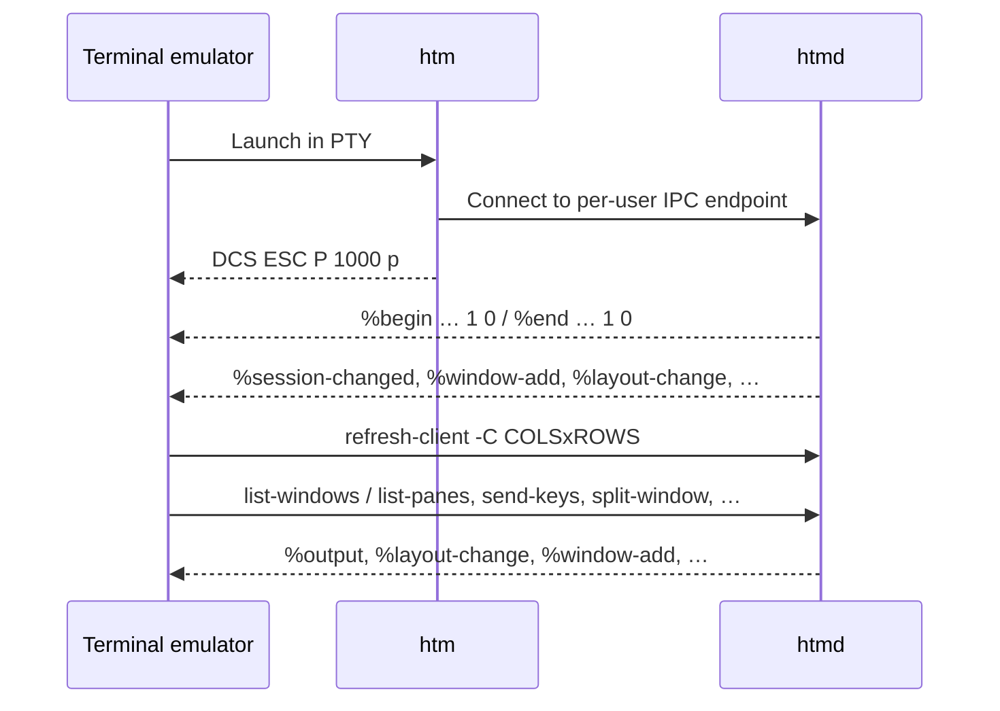

# HTM and tmux Control Mode

HTM is a headless multiplexer that speaks **tmux control mode** (`tmux -CC`)
on the terminal emulator's PTY. It does not define a private byte-framed
protocol. A terminal that already implements tmux integration can drive `htm`
the same way it drives `tmux -CC`.

## Protocol reference

The protocol is tmux's, not HTM's. Use these as the specification:

- [Control Mode](https://github.com/tmux/tmux/wiki/Control-Mode) on the tmux
  wiki (commands, `%begin`/`%end`/`%error` blocks, notifications, pane output,
  `refresh-client` flags, and flow control)
- The **CONTROL MODE** section of [`tmux(1)`](https://man.openbsd.org/tmux.1)
- Layout strings: checksummed `cols x rows,x,y` trees with `{…}` for
  side-by-side splits and `[…]` for stacked splits (the same form
  `list-windows -F '#{window_layout}'` prints)

Identifiers are tmux IDs: `$session`, `@window`, `%pane`. Prefer IDs over
names or indexes.

The rest of this page is only what an integrator needs on top of that
reference: how `htm` enters control mode, which subset `htmd` implements, and
where HTM deliberately differs from a full tmux server.

## Starting and ending control mode

The emulator launches `htm` in a PTY with stdin/stdout left byte-transparent.
`htm` puts the PTY in raw mode, connects to the per-user `htmd` daemon, and
writes the tmux `-CC` DCS so the emulator can detect control mode:

```text
ESC P 1000 p
1b 50 31 30 30 30 70    (hex)
```

The sequence can share a read with later control-mode text. Bytes before it
are ordinary terminal output and MUST be rendered normally.

When `htm` exits (including on SIGTERM / console control), it writes the
matching ST and leaves control mode:

```text
ESC \
1b 5c    (hex)
```

End-of-file on the PTY also ends the session. DCS and ST are terminal-facing
only; they are not sent on the `htm`↔`htmd` socket. See
[`htm` to `htmd` IPC Protocol](htm-ipc-protocol.md).

An empty command line (just Enter / CR / LF) detaches the client, matching
tmux. `detach-client`, `detach`, and `exit` do the same. `kill-server` (or
closing the last pane) stops the daemon.

## Attachment sequence

After the DCS, `htmd` speaks ordinary control-mode lines. On every accept it
sends:

1. An empty **server-originated** reply block (`%begin <t> 1 0` … `%end <t> 1
   0`). iTerm2 waits for this `%end` (flags `0`) before sending
   `refresh-client` / `list-windows`.
2. Snapshot notifications for the attached session:
   `%sessions-changed`, `%session-changed`, `%window-add` and
   `%layout-change` for each window, then `%session-window-changed` and
   `%window-pane-changed`.



`#{version}` expands to `3.5a` so GUI clients enable modern tmux flags
(`refresh-client -C`, `%layout-change` with visible-layout and flags, and so
on). HTM is not tmux 3.5a; the string is compatibility bait.

Reconnection is another snapshot, not a byte-offset replay. Pane PTY output
that arrived while detached is not automatically resent as `%output`; the
emulator SHOULD rebuild native tabs/splits from `%window-add` /
`%layout-change` (or `list-windows -F`) and MAY use `capture-pane` if it
needs current screen contents.

## Commands `htmd` accepts

Clients send standard tmux commands, one per line (CR, LF, or CRLF). Several
commands may be joined with unquoted `;`. Each command produces one
`%begin`/`%end` or `%begin`/`%error` block. Notifications never appear inside
a block.

Implemented for GUI clients (including common aliases):

| Command | Role |
| --- | --- |
| `refresh-client` (`-C` size, `-f`/`-F` flags, `-A` pause/continue) | Client size and flow-control flags |
| `list-sessions`, `list-windows`, `list-panes` | Session topology (`-F` formats) |
| `display-message -p` | Format expansion (`#{pane_id}`, `#{version}`, …) |
| `new-window`, `split-window` (`-h`/`-v`, `-P`) | Tabs and splits |
| `kill-pane`, `kill-window`, `unlink-window` | Close |
| `send-keys` / `send` (`-l`, `-H`) | Pane input |
| `select-pane`, `select-window`, `select-layout` | Focus and layout names |
| `resize-pane` (`-UDLR`, `-Z` zoom) | Split ratios and zoom |
| `swap-pane`, `move-pane` / `join-pane`, `break-pane`, `move-window` | Reparent |
| `rename-window`, `rename-session` | Names |
| `new-session`, `attach-session`, `kill-session` | Sessions |
| `set-option` / `show-options` (user options `@…` only) | Client-stored options |
| `set-buffer` / `show-buffer` | Paste buffers |
| `capture-pane` | Screen + scrollback |
| `list-commands` | Command probe (WezTerm) |
| `detach-client`, `kill-server` | Lifecycle |

`copy-mode`, `list-keys`, `list-clients`, `clear-history`, `link-window`, and
`phony-command` succeed with an empty block and do nothing. Unknown commands
return `%error` with `parse error: unknown command: …`. After `%error`, HTM
stops the rest of a `;` list (iTerm2 does the same).

`refresh-client -B` format subscriptions are not implemented.

## Notifications `htmd` emits

| Notification | When |
| --- | --- |
| `%output %pane octal-escaped-bytes` | Pane PTY data (default) |
| `%extended-output %pane age : bytes` | Pane data when `pause-after` is set |
| `%pause` / `%continue` | Flow control |
| `%layout-change @window layout visible-layout flags` | Split tree changed |
| `%window-add` / `%window-close` | Window created or destroyed |
| `%window-pane-changed` / `%session-window-changed` | Active pane or window |
| `%session-changed` / `%session-renamed` / `%sessions-changed` | Session topology |
| `%paste-buffer-changed` | `set-buffer` |
| `%exit` | Client detach or daemon stop (followed by ST from `htm`) |

Pane output octal-escapes bytes `< 0x20` and `\` (`\` → `\134`), matching
tmux.

`%layout-change` matches tmux 3.x:

```text
%layout-change #{window_id} #{window_layout} #{window_visible_layout} #{window_raw_flags}
```

`window_raw_flags` is `*` when the window is active, `Z` when a pane is
zoomed, or `*Z` for both. When neither applies the flags field is empty, but
the preceding space is still present so parsers that require
`LAYOUT LAYOUT FLAGS` (WezTerm) still match. Visible layout equals layout
unless a pane is zoomed.

Unlinked-session window notifications and `%subscription-changed` are not
emitted.

## Integrator notes

- Launch `htm` through a real PTY. `htm -x` replaces a stale per-user
  daemon.
- Scan for DCS/ST across read boundaries; parse control mode as a line
  stream after DCS.
- Rebuild native tabs and splits from `%window-add` / `%layout-change` (or
  `list-*`). Keep one terminal parser per `%pane`.
- Send `refresh-client -C COLSxROWS` after attach and whenever the UI size
  changes.
- Route keystrokes with `send-keys -t %pane` (hex `-H` is the usual path for
  arbitrary bytes).
- Create splits/tabs with `split-window` / `new-window`; close with
  `kill-pane`. The daemon owns IDs.
- Only one `htm` client is active per user. A new attach evicts the old
  client and repeats the snapshot notifications.

Executable examples: `test/system_tests/htm_pty_e2e.py`,
`test/system_tests/iterm2_htm_e2e.py`, `test/system_tests/hyper_htm_e2e.py`,
`test/system_tests/wezterm_htm_e2e.py`, and
`test/unit_tests/HtmGhosttyE2eTest.cpp`. See
[HTM Design and Architecture](htm-design.md) for process roles.
