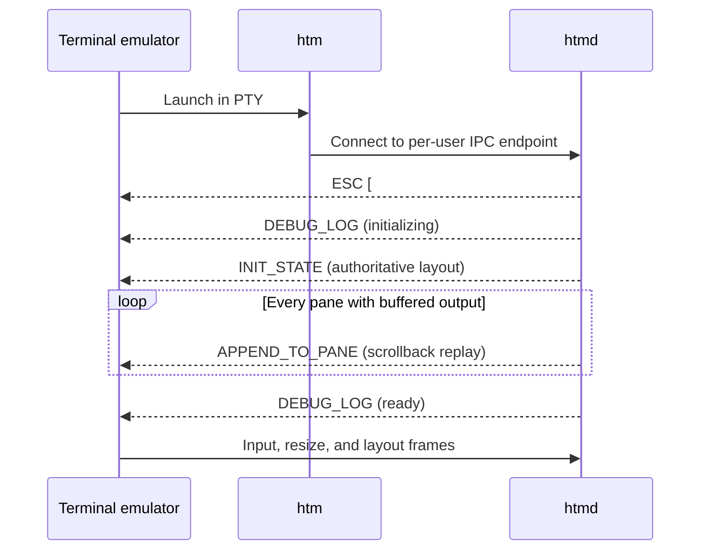

# HTM Terminal Emulator Protocol

## Status and scope

This document describes the byte-stream protocol a terminal emulator implements
to act as the user interface for Eternal Terminal's headless terminal
multiplexer (HTM). It documents the protocol implemented by `htm` and `htmd` at
the time of writing.

The terminal emulator launches `htm` in a pseudoterminal (PTY), reads protocol
messages from the PTY master, and writes protocol messages to it. `htm` is a
local bridge; the persistent multiplexer and pane PTYs live in `htmd`.

The protocol currently has no version negotiation. An implementation should
ignore unknown server message types only when it can safely skip their framed
payload. An incompatible future revision will need an explicit negotiation
mechanism before changing the framing or existing message meanings.

The words **MUST**, **SHOULD**, and **MAY** describe interoperability
requirements.

## Starting and ending HTM mode

The terminal emulator starts `htm` with its standard input and standard output
connected to a PTY. `htm` puts that PTY into raw mode and starts or attaches to
the per-user `htmd` daemon.

Before HTM mode begins, output is an ordinary terminal byte stream. The daemon
marks the transition to protocol mode with this six-byte sequence:

```text
ESC [ # # # q
1b  5b 23 23 23 71    (hex)
```

The emulator MUST scan for this sequence across arbitrary read boundaries. It
MUST render bytes before the sequence normally, consume the sequence itself,
then interpret subsequent bytes as framed HTM messages. The sequence and the
first message can arrive in the same read.

When `htm` exits or handles a termination signal, it writes:

```text
ESC [ $ $ $ q
1b  5b 24 24 24 71    (hex)
```

The emulator MUST consume this sequence and leave HTM mode. End-of-file on the
PTY also ends the session. The exit sequence is terminal-facing only and is not
an HTM frame.

## Framing

Except for `SESSION_END`, every message has this layout:

```text
+----------+--------------------------+-----------------------+
| type     | encoded payload length   | payload               |
| 1 byte   | 8 ASCII bytes            | length bytes          |
+----------+--------------------------+-----------------------+
```

- `type` is one ASCII byte from the message table below.
- `encoded payload length` is standard padded Base64 encoding of a signed
  32-bit little-endian integer. Encoding four bytes always produces eight
  ASCII bytes. For example, payload length 36 is the Base64 text `JAAAAA==`.
- `payload` contains exactly the declared number of bytes. The length counts
  bytes on the wire, including Base64 text where a message uses Base64 for a
  field.
- `SESSION_END` is the single byte `D` and has no length or payload.

Terminal emulators MUST treat the transport as a stream: a read can contain a
partial message, one message, or several messages. Parsers MUST reject negative
or unreasonably large lengths and SHOULD impose a local maximum. The `htm`
client currently uses 4 MiB as its maximum parsed server frame.

All identifiers are lowercase, hyphenated UUID strings encoded as 36 ASCII
bytes, for example `123e4567-e89b-12d3-a456-426614174000`. UUID fields are not
Base64 encoded.

Payload fields described as `Base64(data)` use the standard Base64 alphabet
with `=` padding. Pane input and output are byte strings; they are not required
to be UTF-8.

## Message types

| Type | Name | Direction | Payload |
| --- | --- | --- | --- |
| `1` | `INSERT_KEYS` | emulator to server | `pane_id[36] + Base64(input_bytes)` |
| `2` | `INIT_STATE` | server to emulator | UTF-8 JSON state, unencoded |
| `3` | `CLIENT_CLOSE_PANE` | emulator to server | `pane_id[36]` |
| `4` | `APPEND_TO_PANE` | server to emulator | `pane_id[36] + Base64(output_bytes)` |
| `5` | `NEW_TAB` | emulator to server | `tab_id[36] + pane_id[36]` |
| `8` | `SERVER_CLOSE_PANE` | server to emulator | `pane_id[36]` |
| `9` | `NEW_SPLIT` | emulator to server | `source_pane_id[36] + new_pane_id[36] + orientation[1]` |
| `A` | `RESIZE_PANE` | emulator to server | `Base64LE32(cols)[8] + Base64LE32(rows)[8] + pane_id[36]` |
| `B` | `DEBUG_LOG` | server to emulator | `Base64(message_bytes)` |
| `C` | `INSERT_DEBUG_KEYS` | emulator to server | raw command bytes |
| `D` | `SESSION_END` | emulator to server; server to `htm` | No length and no payload |

`Base64LE32(n)` means standard Base64 encoding of the four-byte signed
little-endian representation of `n`.

### `INIT_STATE` JSON

`INIT_STATE` is the authoritative layout snapshot sent on every attachment.
Its payload has this shape:

```json
{
  "shell": "/bin/sh",
  "tabs": {
    "<tab-uuid>": {
      "id": "<tab-uuid>",
      "order": 0,
      "paneOrSplit": "<pane-or-split-uuid>"
    }
  },
  "panes": {
    "<pane-uuid>": {
      "id": "<pane-uuid>"
    }
  },
  "splits": {
    "<split-uuid>": {
      "id": "<split-uuid>",
      "vertical": true,
      "panesOrSplits": ["<child-uuid>", "<child-uuid>"],
      "sizes": [0.5, 0.5]
    }
  }
}
```

Object keys and their embedded `id` values identify the same object. A tab's
`paneOrSplit` points to its root pane or split. A split's `panesOrSplits` is an
ordered list whose entries refer to panes or nested splits, and `sizes` gives
the corresponding proportions. `order` controls tab ordering. `shell` is
informational.

On receipt, the emulator MUST reconcile its UI with this snapshot before
applying subsequent pane-output frames. It SHOULD tolerate an absent or empty
`splits` object when no split exists.

### Input and output

To send user input, the emulator sends `INSERT_KEYS` for the focused pane.
Because the data is Base64 encoded, control sequences and arbitrary bytes are
preserved. The server decodes the field and writes it to that pane's PTY.

The server reports pane PTY output with `APPEND_TO_PANE`. The emulator decodes
the Base64 tail and feeds the resulting bytes to the terminal parser belonging
to that pane. It MUST keep parser state independently for every pane.

### Tabs, splits, and closing panes

For `NEW_TAB`, the emulator generates a new tab UUID and initial pane UUID. It
SHOULD create the visual tab only after it can associate it with those stable
identifiers.

For `NEW_SPLIT`, `source_pane_id` identifies an existing pane and
`new_pane_id` is generated by the emulator. `orientation` is ASCII `1` for a
vertical split and ASCII `0` for a horizontal split. The daemon owns the
resulting split-tree identifiers and returns them in the next `INIT_STATE`.

`CLIENT_CLOSE_PANE` requests closure from the UI. `SERVER_CLOSE_PANE` reports
that the pane's shell exited. On either path, the emulator must remove the pane
and collapse or remove its visual containers consistently. Closing the final
pane ends the daemon session.

### Resizing

`RESIZE_PANE` carries columns first and rows second. Both are positive signed
32-bit integers. The emulator SHOULD send an initial size when a pane surface
is created and another message whenever its cell dimensions change.

### Debug channel

`DEBUG_LOG` is informational text intended for diagnostics or a gateway
surface. `INSERT_DEBUG_KEYS` is a developer control channel currently
interpreted by `htmd` as follows:

- first byte `x`: stop the daemon and all panes;
- first byte `ESC` (`0x1b`): detach the current client but leave panes alive;
- first byte `d`: log the current state JSON.

These commands are not normal pane input. A production integration SHOULD keep
them separate from the user's terminal keystrokes. An `INSERT_DEBUG_KEYS`
payload MUST contain at least one byte.

## Attachment and recovery sequence

Each new terminal-emulator attachment receives a complete recovery stream:



The emulator MUST be prepared for the init marker and several frames to arrive
together. It SHOULD build the layout from `INIT_STATE`, then apply replayed
`APPEND_TO_PANE` messages in stream order. `htmd` retains at most 1,024 lines
and approximately 128 KiB of recent output per pane for replay.

Only one `htm` client is active for a per-user daemon. Another client is not
accepted until the active client detaches; after acceptance it receives a fresh
recovery stream. A disconnected UI can therefore relaunch `htm` and reconstruct
the session without restarting pane shells.

## Integration checklist

An interoperable terminal emulator should verify all of the following:

1. Launch `htm` through a real PTY and leave its stdin/stdout byte-transparent.
2. Detect split and coalesced init/exit sequences.
3. Buffer fragmented headers, lengths, and payloads; parse multiple frames per
   read.
4. Decode lengths as signed little-endian 32-bit values and enforce a maximum.
5. Maintain stable UUID mappings for tabs, splits, panes, and per-pane terminal
   parser state.
6. Reconstruct nested layouts from `INIT_STATE` and replay buffered output.
7. Route binary input/output, resize events, close events, and shell exits.
8. Handle detach, daemon shutdown, PTY EOF, and relaunch/recovery.
9. Exercise high-volume output while input is still flowing to catch
   backpressure deadlocks.

The repository's PTY and terminal-specific end-to-end tests provide executable
examples in `test/system_tests/htm_pty_e2e.py`,
`test/system_tests/iterm2_htm_e2e.py`, and
`test/unit_tests/HtmGhosttyE2eTest.cpp`.
