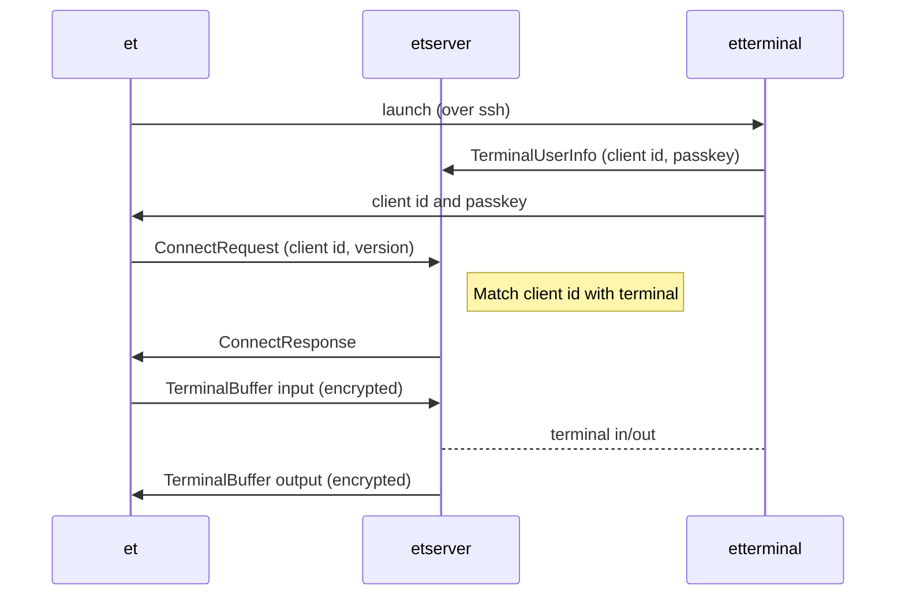

# EternalTerminal Protocol

## Architecture 


EternalTerminal uses three processes:
* **et** on the client machine.
* **etterminal** which runs as the user and hosts the terminal.
* **etserver** which connects users to their terminals.

## Terminal Connection



EternalTerminal uses SSH for authentication, and provides reconnectable sessions through the etserver process.

### etterminal launch

To start, et (which runs on the client), connects to the server over ssh to launch the etterminal process. Due to legacy reasons, the client sends the id and passkey to the server, but for supported clients the server will regenerate them and send updated ones to the client.

In [`SshSetupHandler.cpp`](https://github.com/MisterTea/EternalTerminal/blob/113fb23133eabce3d11681392d75ba4772814b44/src/terminal/SshSetupHandler.cpp#L11-L12), a command like the following is constructed:

```sh
echo 'XXX1234567890123/12345678901234567890123456789012_xterm-256color' | etterminal
```

The string is composed of a 16-character **client-id**, followed by a slash (`/`), followed by a 32-character **passkey**, an underscore (`_`), and value of the `$TERM` environment variable.

The **client-id** begins with "XXX" for newer clients to indicate that the server should regenerate it.

Once etterminal launches:
- It detects if the **client-id** begins with "XXX", and optionally regenerates the **client-id** and **passkey**.
- It [locates the server fifo](https://github.com/MisterTea/EternalTerminal/blob/113fb23133eabce3d11681392d75ba4772814b44/src/terminal/ServerFifoPath.cpp) to connect to the etserver process:
  - If `/var/run/etserver.idpasskey.fifo` exists, when etserver is running as root, this path is used.
  - Otherwise, `$XDG_RUNTIME_DIR/etserver/etserver.ifpasskey.fifo` is used, resolving `$XDG_RUNTIME_DIR` to `$HOME/.local/share` if the environment variable is not set.
- Once it connects to the server, it sends a `TERMINAL_USER_INFO` packet with [TerminalUserInfo](https://github.com/MisterTea/EternalTerminal/blob/113fb23133eabce3d11681392d75ba4772814b44/proto/ETerminal.proto#L79-L85) containing the **client-id** and **passkey** to register the terminal with the server.  These are registered into the ServerConnection [`clientKeys` map](https://github.com/MisterTea/EternalTerminal/blob/113fb23133eabce3d11681392d75ba4772814b44/src/base/ServerConnection.hpp#L37-L40) awaiting a user connection.
- After etterminal connects to etserver, it outputs the **client-id** and **passkey**, to inform the client in cases where it regenerated them.
- etterminal then waits for a client connect, waiting for a `TERMINAL_INIT` ([TermInit](https://github.com/MisterTea/EternalTerminal/blob/113fb23133eabce3d11681392d75ba4772814b44/proto/ETerminal.proto#L74-L77)) packet.
- After receiving this packet UserTerminalHandler enters the `runUserTerminal` run loop, and proxies input/output until the terminal exits. See the [Terminal Run Loop](#terminal-run-loop).

## Client Connection

After the terminal launches, **et** connects to the **etserver** over the EternalTerminal port (defaults to 2022), and sends a [ConnectRequest](https://github.com/MisterTea/EternalTerminal/blob/113fb23133eabce3d11681392d75ba4772814b44/proto/ET.proto#L12-L15) message containing the **client-id** and protocol version.  Note that this since encryption is client-specific, this client-id is sent unencrypted.

The **client-id** is looked up in the ServerConnection `clientKeys` map, and if it is found a ServerClientConnection is created, which contains the BackedReader and BackedWriter used for EternalTCP buffering.

A ConnectResponse is returned with a status of either `INVALID_KEY`, `NEW_CLIENT`, or `RETURNING_CLIENT` based on the results of the `clientKeys` lookup.  If there's an error the socket is then closed.

## Reconnection

One of the core features of EternalTerminal is handling reconnections, in a way that is seamless to the user: If the previous connection gets interrupted, a new connection is established and continues where the previous connection left off.

When a client disconnects, the etterminal process continues running, and the client id remains registered with etserver.

To enable reconnects, **et** opens a new connection to the EternalTerminal port, and sends a new [ConnectRequest](https://github.com/MisterTea/EternalTerminal/blob/113fb23133eabce3d11681392d75ba4772814b44/proto/ET.proto#L12-L15) message containing the same **client-id** and protocol version as the initial request.

Upon reconnect, if the server identifies the ServerClientConnection already exists, it sends a ConnectResponse with status `RETURNING_CLIENT` as a response, and then bidirectional SequenceHeader protobufs are exchanged which contain the last received **sequence number** for each side.

Based on this, a CatchupBuffer protobufs are swapped, containing the missing encrypted packets based on the **sequence number**.

## Port Forwarding


## Jumphosts


**et** may optionally connect to the destination server through a jumphost, enabling it to reach destinations that are not directly accessible.  This is enabled by passing the `--jumphost` parameter or specified in the SSH config files.

When a jumphost is enabled, **et** launches two `etterminal` processes, one on the jumphost and another on the desination.  On the jumphost, `etterminal` is launched with the `--jump` parameter which configures it to launch in jumphost mode.

When the `etterminal` jumphost launches, a UserJumphostHandler is created which connects to **etserver** the same way as a terminal: by sending a UserTerminalInfo packet.

After jumphost `etterminal` connects to the jumphost `etserver` process, it sends a `JUMPHOST_INIT` (with an InitialPayload) packet, instead of the terminal's `TERMINAL_INIT`.  After receiving this, UserJumphostHandler knows the client has connected, and creates a ClientConnection to the destination server.

It then forwards the InitialPayload to the destination server, and waits for an `INITIAL_RESPONSE` (with an InitialResponse). If this response is successful, UserJumphostHandler enters its run loop, which is described in [Jumphost Run Loop](#jumphost-run-loop).

## Terminal Run Loop

The terminal run loop is within [`UserTerminalHandler::runUserTerminal`](https://github.com/MisterTea/EternalTerminal/blob/113fb23133eabce3d11681392d75ba4772814b44/src/terminal/UserTerminalHandler.cpp#L64), within the `etterminal` process, and starts after the `TERMINAL_INIT` (with a TermInit payload) is received.

It proxies between the user terminal fd (`masterFd`) and the router fifo. When terminal output is generated, it is read and the raw bytes are forwarded to the router fifo.

From the router fifo, packets may be sent to either forward input to the terminal or configure the terminal state:
- `TERMINAL_BUFFER` (with a TerminalBuffer payload) data is written to the terminal as user input.
- `TERMINAL_INFO` (with a TerminalInfo) is used to adjust the window size of the terminal.

## Jumphost Run Loop

The jumphost run loop is within [`UserJumphostHandler::run`](https://github.com/MisterTea/EternalTerminal/blob/113fb23133eabce3d11681392d75ba4772814b44/src/terminal/UserJumphostHandler.cpp#L124), and runs within the `etterminal` process on the jumphost, ater the connection has been started and the InitialResponse has been received.

In the run-loop, UserJumpHostHandler acts as a proxy between the destination server and the jumphost `etserver`:
- It reads packets from the local `etserver` over the fifo, and forwards them to the destination server.
- It reads reads packets from the destination server, and forwards them to the local `etserver` fifo.
- If the user disconnects from the jumphost, it close the connection to the destination server.
